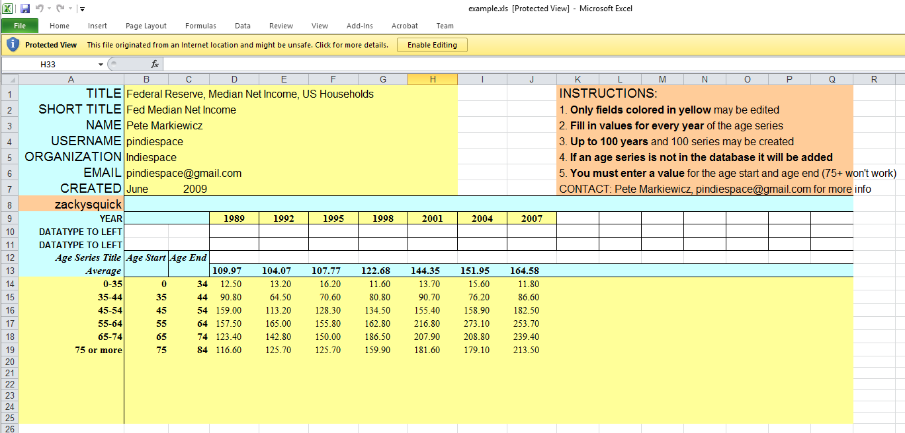
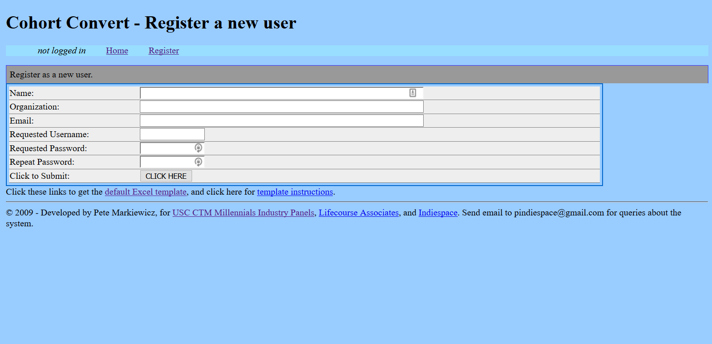
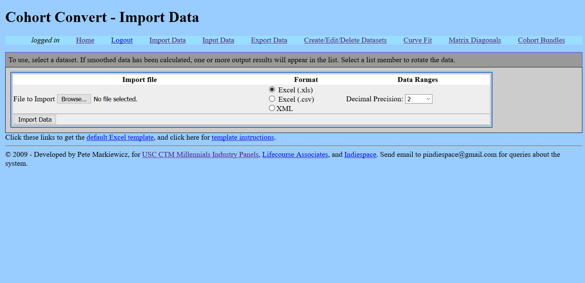
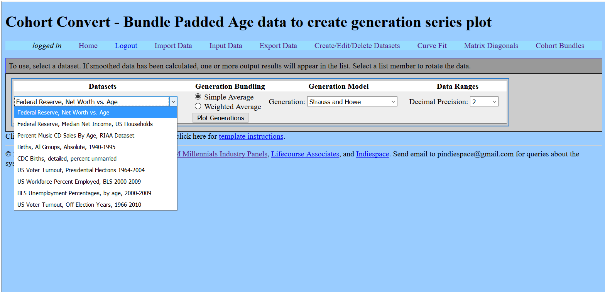
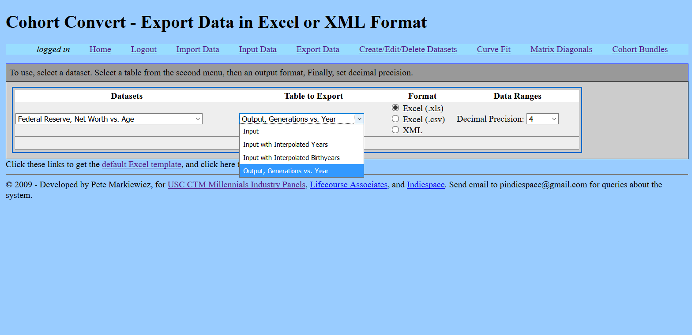
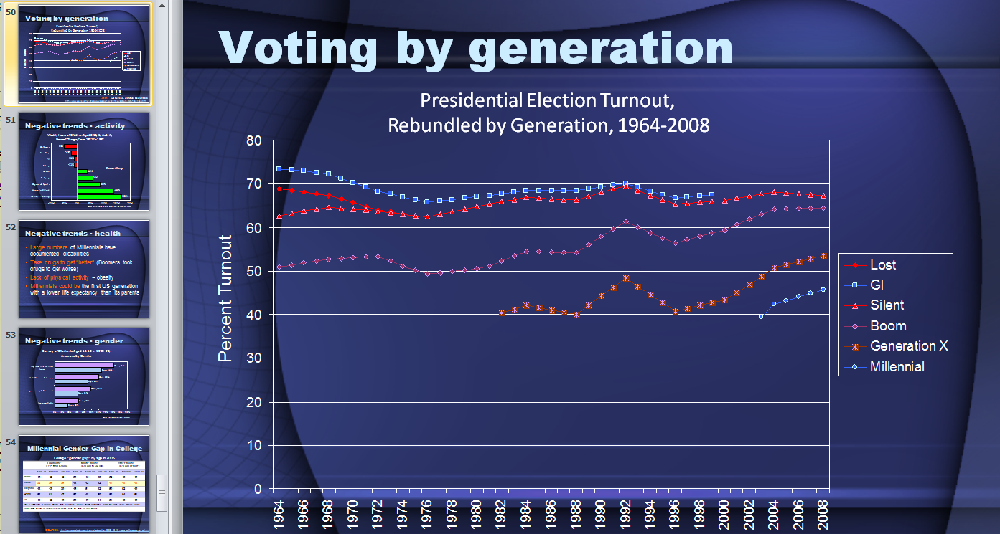

## cohort-convert - a generation analysis tool.

The goals:

1. See which features of Millennials (and other generations) show a cohort effect, e.g. demographics.

2. Determine the degree to which the cohort "swimlanes" match generational models, e.g. the Strauss & Howe generations vs. the Twenge GenY model.

3. Provide research into generation validity for discussions of the Millennial generation I conducted at the USC Marshall School of Business in the 2000s, as well as contributes to the Lifecourse (Strauss & Howe) discussion group. 

4. [CTM Conference to Examine Millennial Impacts on Business (2008)](https://www.marshall.usc.edu/news/releases/2008/ctm-conference-examine-millennial-impacts-business)

5. [Link to app](http://plyojump.com/cohort_convert/)

## Description

This application allows y=f(x) data to be re-plotted, where x = years and y= a particular property, like personal income, grouped by the age of thr responders. The application performs a 'rotation' of the data, and re-plots it so the age-range versus response year are now plotted for cohort bundles, a.k.a. generations. In this way, the degree to which pop culture, demographics, or social attitudes are based on generation (Millennial, Boomer, GenX, Silent, Plural, etc) may be estimated. 

Options include:

 * Smoothing data into a larger number of points along x (year) and y (value) axes rotated so that age range series are converted to birthyear series
 * Plotting data with several chart formats
 * Import/Export of data to Excel

## Theory

The program was written to explore whether generations, defined as people born in a specific range of years (e.g. Baby Boomers with a birthyear range 1943-1961) are validated by demographics and survey data. Most research of this type involves life stage - a survey question or demographic is tested on a regular (often yearly) basis. This data often groups responses against age ranges, e.g. 25-34 years over a 10 year period. It tells us what people are thinking, but doesn't tell us if it is due to their age (life-stage dependent), or the year they were born in (generation/cohort).

To get data for generations, one needs to collect data for cohorts. However, few surveys track the same people over time, and repeatedly ask them questions, which is what would be required for a true cohort study. 

Cohort data is, however, buried in the age range vs. year data. If the survey runs long enough, people in a younger age group (e.g. 25-34) will migrated into an older group (e.g. 35-50). By looking along the diagonals of the year verus age-range data, one can see cohorts advancing through time.

An additional wrinkle is that the age ranges bundle one group, while generations bundle a range of birthyears. So, the diagonals won't be simple.

To handle this, the application loads data plotted value (e.g. a response to a survey) against year. A typical example would be US Census data that lists demographics (e.g. out of wedlock births) against year. The goal is to see if generations (e.g. cohorts) really exist. 

 After the data is loaded, a cohort analysis begins by "rebundling the range of ages. The bundled age range data is interpolated so that points are created for every possible age (year) for all the survey questions. The additional points are generated via linear smoothing, and are are not meant to provide hardcore statistical validity.

 In the second step. the age vs demographic/survey question grid is rotated so that the data series are now birthyears plotted against age. Lines on this plot directly trace cohorts born in one year over time. By looking at the lines (or bands) one can explore groupings of birthyears versus the trait being analyzed - evidence for generations. 

## Usage

The program operates with a front-end Web API.

1. An MS Excel file needs to be prepared (templates are present)

- [Link to Excel file](http://plyojump.com/cohort_convert/templates/example.xls)
- [Template Instructions](http://plyojump.com/cohort_convert/instructions.php)

2. After the Excel File is created, you need to register an account, then log in with your account.

2. Template with data is uploaded via the web interface. 

Once uploaded, the data is stored in a MySQL database which may be accessed for further manipulation.

3. By selecting various menu options, the program can output converted data. The image below shows the screen for outputting the data, with cohorts explicitly tested against generations.

4. The program output to the screen is primarily for debugging. However, the data is cached so it can be exported later.

4. Resulting Excel file can be used to generate charts, graphics and other visualization output. An example of output is shown below, where voting data by age was rebundled to show how different generations voted in the 2000s.

If you're interested in the data above, you can [download the Millennials in 2014 file here](http://plyojump.com/archives/seminars/millennials_12-2014_overview.ppt). The full stack of Millennial presentations is available on [Plyojump.com](http://plyojump.com). See even more about generations by visiting the [Lifecourse Website](http://lifecourse.com), maintained by Neil Howe, co-creator of the Millennial generation concept.

## Tech

The program was written in PHP, and uses a MySQL database to archive uploaded data and handle user accounts.

The program code was written in early PHP 5, meaning that it uses objects, but retains a fairly procedural structure compared to more modern programs. The program is designed to explore the idea of analyzing cohorts, and was not built out into a complete web app. In particular, the online editing and record creation option is incomplete. Finally, the code has basic security tests, but was not hardened for security. 

